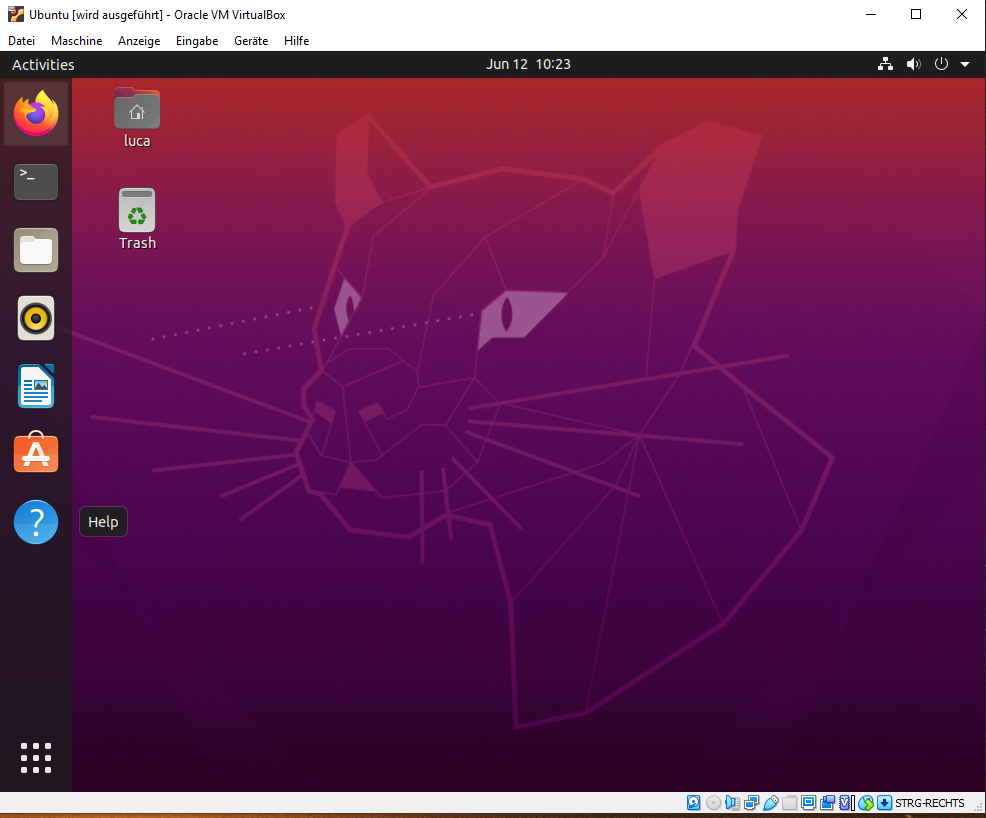
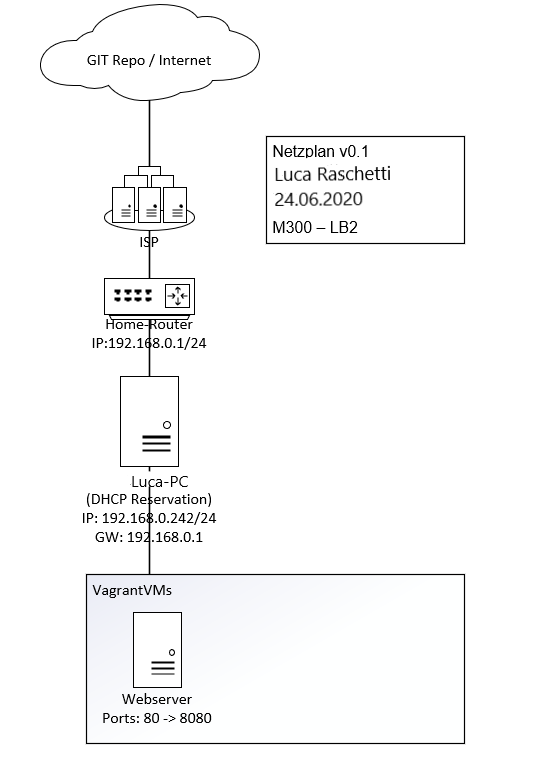
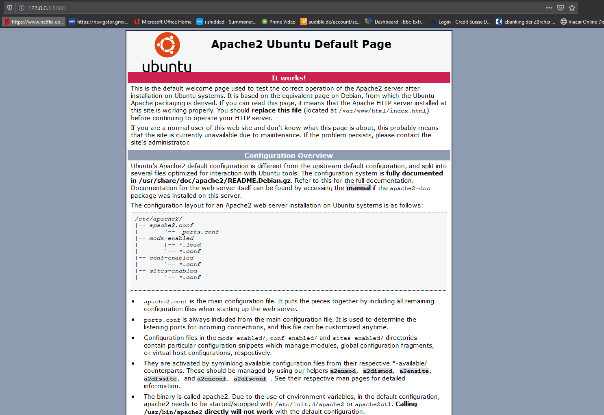
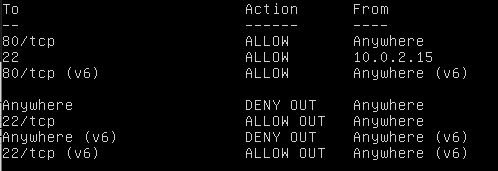
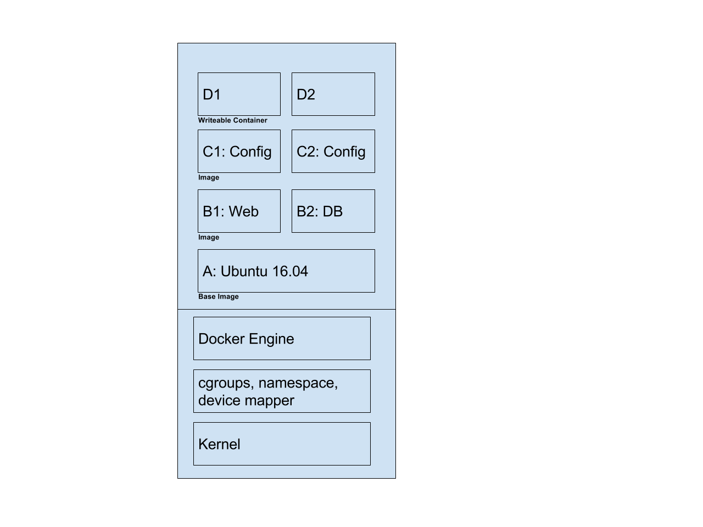
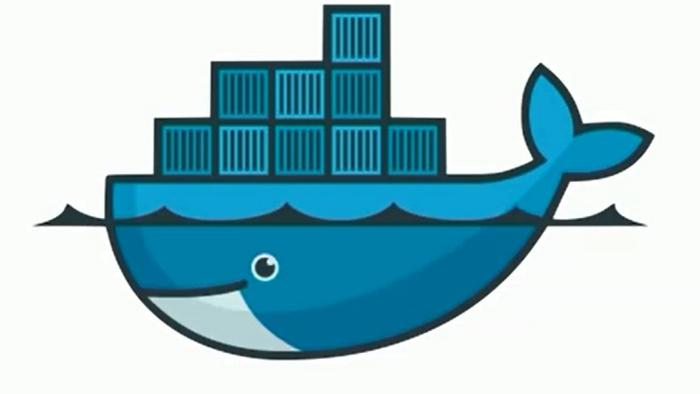
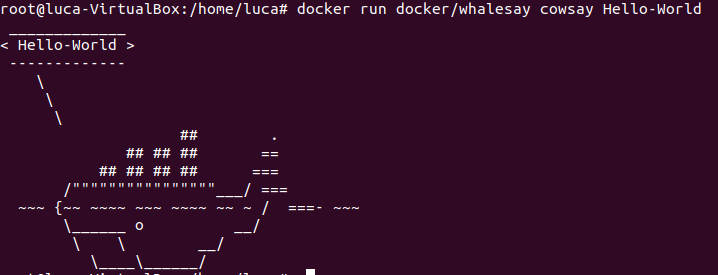
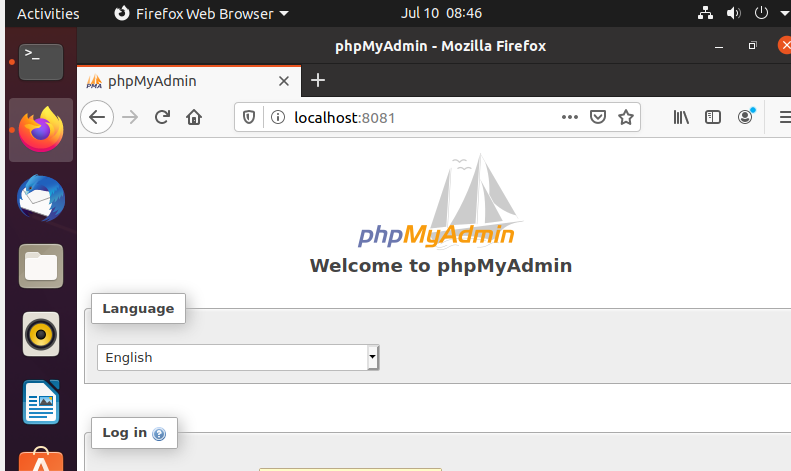
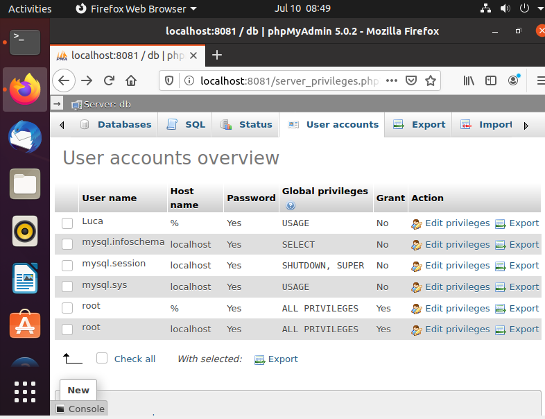

# M300-Vservice

## Modul 300 LB02

Luca Raschetti

Dies ist eine Dokumentation für die LB02 im Modul 300. In dieser Dokumentation soll ich meine Arbeitsschritte festhalten.

# K1 Einrichtung

In diesem Punkt soll die Struktur für die Weitere LB aufgebaut werden. Hierzu waren folgende Programme notwendig:

* VirtualBox
* Vagrant
* Visualstudio-Code
* Git-Client
* SSH-Key für Client erstellt

Für die meisten Elemente in dieser Liste bedarf es keiner Erklärung. Den SSH Key habe ich entsprechend der Aufgabe auf Github in den Einstellungen erstellt. Den Git-Client konnte ich auch dort herunterladen.

Mit der Lizenz welche wir von der TBZ zur Verfügung hatten, konnte ich VisualStudio Code installieren, da ich aber Probleme damit hatte, habe ich mich kurzfristig auf Atom umgestellt.

Vagrant konnte ich als Add-On zu Git-Hub herunterladen. Mit Vagrant lassen sich VMs einfach über die Git-Bash Konsole erstellen.

VirtualBox war gratis für die Installation auf ihrer Webseite.

Danach habe ich noch einen Linux Ubuntu Client aufgesetzt.

### Lernjournal

**Kannte ich schon:** Ich kannte schon die Programme Virtual Box und den Git-Client.

**War neu für mich:** Das Programm Vagrant und dessen Vorteile kannte ich noch nicht. Auch habe ich einen schnelleren Umgang mit Git-Bash gelernt. Auch habe ich noch nie einen SSH Key über git Bash aufgesetzt.

# K2 Lernumgebung

In diesem Punkt geht es um das registrieren und vorbereiten für die nächsten Aufgaben. Hierzu sollten folgende Punkte erledigt werden. Auf der Webseite von Github www.github.com kann man ganz simple ein neue Konto eröffnen.

* GitHub oder Gitlab-Account ist erstellt
* Git-Client wurde verwendet
* Dokumentation ist als Mark Down vorhanden
* Markdown-Editor ausgewählt und eingerichtet
* Mark down ist strukturiert
* Persönlicher Wissenstand im Bezug auf die wichtigsten Themen sind  dokumentiert
* Wichtige Lernschritte sind dokumentiert

Nun zu einigen von diesen Punkten braucht es wieder keine Erklärung. Die Dokumentation wurde als Mark Down angelegt.
Kommen wir zu einigen Begriffen welche geklärt werden sollten.
**Linux** ist ein Open Source Betriebssystem. Die Vorteile von Linux liegen darin, dass jeder den Code einsehen und benutzen kann. So können Sicherheitslücken besser geschlossen werden und es kann viel optimiert werden.
Die **Virtualisierung** soll die Wartung von Arbeitsplätzen oder Servern vereinfachen. Anstelle von Vielen Servern, werden nur weniger eingesetzt. Es wird also weniger Hardware gebraucht. Auf den Servern ist ein Programm für die Virtualisierung installiert. Nun lassen sich auf diesem Server mithilfe der Virtualisierung Virtuele Server, Clients und Netze installieren.
**Vagrant** ist eine Freie Software für das erstellen von Virtuellen Maschinen. Mit Vagrant lassen sich auch einige Arbeitsschritte automatisieren.
**Git** ist eine Freeware welche zur Pensionierung und Veröffentlichung/Verteilung von Programmen gebraucht wird.

### Lernjournal

**Kannte ich schon:** Ich kannte Github ein wenig aber nicht besonders gut um alles auswenig zu erstellen.

**War neu für mich:** Ich habe vor diesem Project noch nie mit Git-Hub gearbeitet. Ich muss sagen, dass ich gefallen daran gefunden habe. Ich habe einen Editor benutzt namens Atom um den Text vorzubereiten. Danach konnte ich einfach alles Kopieren und hier bei Atom einsetzen.

# K3 Vagrant

Zu Vagrant habe ich schon im Abschnitt K2 geschrieben.
Dies sind die Punkte welche ich erfüllen sollte:

* Bestehende vm aus Vagrant-Cloud einrichten
* Kennt die Vagrant-Befehle
* Eingerichtete Umgebung ist dokumentiert (UmgebungsVariablen, Netzwerkplan gezeichnet, Sicherheitsaspekte)
* Funktionsweise getestet inkl. Dokumentation der Testfälle
* vorgefertigte vm auf eigenem Notebook aufgesetzt
* Projekt mit Git und Mark Down dokumentiert

Boxen sind bei Vagrant vorkonfigurierte VMs (Vorlagen). Diese sollen den Prozess der Softwareverteilung und der Entwicklung beschleunigen. Boxen können explizit durch den Befehl vagrant box add [box-name] oder vagrant box add [box-url] heruntergeladen und durch vagrant box remove [box-name] entfernt werden.
Die Konfiguration findet hier im Vagrant File Statt. In das Vagrant File sollen folgende Zeilen hineingeschrieben werden:
Vagrant File einrichten: Um die Maschine auf trap zu bringen, muss das Vagrantfile angepasst werden und zwar mit dieser Konfiguration.

    Vagrant.configure(2) do |config|
      config.vm.box = "ubuntu/xenial64"
      config.vm.network "forwarded_port", guest:80, host:8080, auto_correct: true
      config.vm.synced_folder ".", "/var/www/html"  
      config.vm.provider "virtualbox" do |vb|
      vb.memory = "512"  
        end

        config.vm.provision "shell", inline: <<-SHELL
        sudo apt-get update
        sudo apt-get -y install apache2
        SHELL
      end

## Netzwerkplan

## Testing

### Verfügbarkeit Testen

Als erstes testen wir ob die Webseite überhaupt aufrufbar ist. Dafür geben wir folgendes im Webbrowser ein: "127.0.0.1:8080". Da wir noch nichts am Index.html geändert haben, sollte nun die Apache-Standardseite angezeigt werden.

### Testergebnis: Gut

### Index Testen

Zudem möchte ich noch testen ob das Template welches ich bei w3schools genommen habe sich integrieren lässt und es übernimmt.

Testergebnis: Gut

## Befehle Vagrant Cheat Sheet

    Vagrant box add [box add]: downloaded Vagrant image local store

    Vagrant box remove [box add]: entfernt Vagrant image local store

    Vagrant box list: Zeigd downloaded boxes an

    vagrant init [box]: initialisiert Vagrantfile

    Vagrant up: startet VM's aus Vagrantfile

    Vagrant status: Zeigt Status der Vagrant box

    Vagrant halt: stopt VM's

    Vagrant destroy: zerstört VM's

    Vagrant ssh [vmname]: Verbindet per ssh auf VM

    vagrant version: zeig Version von Vagrant

    vagrant port: Zeigt portmapping zwischen host und gast

## Versionsverwaltung / GIT

    git add -A : Änderungen im aktuellen Verzeichnis zum Zwischenspeicher hinzufügen

    git commit : Änderungen auf dem lokalen Git speichern

    git push : Lokales Git auf Github synchronisieren

    git clone : Github Repo herunterladen

    git init : Repo initialisieren

### Lernjournal

**Kannte ich nicht:** Ich kannte mich gar nicht mit Vagrant aus und wusste zuerst auch nicht wie damit umzugehen, zum Glück gab es ein Cheat Sheet auf dem BSCW.

**War neu für mich** Ich kann nun Virtuelle Maschienen mit Vagrant erstellen. Ich kann auch anschliessend auf diese drauf Verbinden und sie konfigurieren. Während meiner Arbeitszeit konnte ich die Befehle von Vagrant zu genüge einsetzen, sodass ich sie jetzt gut kenne.

# K4

Hier sind wieder die Verlangten Punkte aufgelistet:

* Firewall eingerichtet inkl. Rules
* Reverse-Proxy eingerichtet
* Benutzer- und Rechtevergabe ist eingerichtet (optional)
* Zugang mit SSH-Tunnel abgesichert
* Sicherheitsmassnahmen sind dokumentiert
* Projekt mit Git und Mark Down dokumentiert

FireWall Zuerst habe ich das Programm UFW welches wir für
diese Aufgabe verwenden sollten installiert. sudo apt-get install ufw

Mit sudo ufw status lässt sich der Status überprüfen. Mit sudo ufw enable lässt sich die FireWall einschalten und mit sudo ufw disable lässt sie sich deaktivieren.

Danach gilt es die nötigen Ports in der FireWall zu öffnen. Ich habe Port 22 für meinen Laptop freigegeben um weiterhin mit ssh darauf zugreifen zu können. sudo ufw allow from 10.0.2.2 to any port 22 Danach habe ich noch Port 80 für http freigegeben. sudo ufw allow 80/tcp

Beim installieren der FireWall ist darauf zu achten, die richtigen Ports für die richtigen IP Adressen freizugeben. So ist es mir passiert, dass ich den Port 22 für die Falsche Adresse freigegeben habe. So konnte ich nicht mehr auf meine VM Zugreifen und mein Fortschritt war dahin.

Zum Testen am Ende kann man einfach sudo ufw status eingeben. Die Ausgabe beschriebt auf welchen ports welche Komunikation zugelassen ist. Bei mir sieht dies wie folgt aus:

## SSH Tunnel

Ich habe als gegensatz von der Benutzerverwaltung, welche ich nicht als sonderlich wichtig empfand bei solch einer Umgebung einen SSH Tunnel erstellt und zwar wie folgt:

    cd user
    vagrant ssh database
    # Wechsel auf User admin01
    sudo su - admin01
    # in der VM
    ssh -L 8000:localhost:80 web01 -N &
    netstat -tulpen
    curl http://localhost:8000

**Kannte ich nicht:** Ich kannte mich etwas mit FireWalls und deren Rules ein wenig aus auf der Linux umgebung aus. Zudem hatte ich ein Vorwissen über SSH Tunnel aber wusste nicht wie es einzurichten gilt.

**War neu für mich** Ich kann nun eine UFW Firewall aufsetzen und konfigurieren. Ich kann einzelne Ports freigeben. Ich kann einen ReverseProxy einrichten.

# Modul 300 LB03
Luca Raschetti  
Dies ist die Dokumentation für die LB03 im Modul 300. In dieser Dokumentation soll ich meine Arbeitsschritte festhalten.

# K1

In diesem Punkt soll die Struktur für die Weitere LB aufgebaut werden. Hierzu waren folgende Programme notwendig:

* VirtualBox
* (Vagrant)
* Atom
* Git-Client
* SSH-Key für Client erstellt

Für die meisten Elemente in dieser Liste bedarf es keiner Erklärung zumal dies schon in der LB02 benötigt wird.

**Kannte ich schon:** Zumal das die gleichen Kriterien sind wi bei K1 in der LB2 kannte ich schon alles.

Siehe auch LB02

# K2

Hier soll man nun die eigene Lernumgebung einrichten.

* GitHub oder Gitlab-Account ist erstellt
* Git-Clienmt wurde verwendet
* Dokumentation ist als Markdown vorhanden
* Markdown-Editor ausgewählt und eingerichtet
* Markdown ist strukturiert
* Persönlicher Wissenstand im Bezug auf die wichtigsten Themen ist dokumentiert (Containisierung / Docker / Microservices)
* Wichtige Lernschritte sind dokumentiert

## Containisierung

Bei der Containerisierung handelt es sich um eine Art Virtualisierung auf Anwendungsebene, bei der mehrere isolierte Userspace-Instanzen auf einem einzelnen Kernel ausgeführt werden können. Diese Instanzen werden Container genannt.
Container bieten eine Standardmethode um Anwendungscode, Laufzeitumgebung, Systemwerkzeugen, Systembibliotheken und Konfigurationen in einer Instanz zusammenzufassen. Container teilen sich einen Kernel (Betriebssystem), der auf der Hardware installiert ist.

### Vorteile
* Resourcenbedarf
Container benötigen auf dem Server weniger Ressourcen als virtuelle Maschinen und sind normalerweise innerhalb weniger Sekunden gestartet.

* Elastizität
Container sind hochelastisch und müssen nicht mit einer bestimmten Menge an Ressourcen ausgestattet werden. Dies bedeutet, dass Container die Ressourcen des Servers effizienter und dynamischer nutzen können. Wenn der Ressourcenbedarf eines Container abnimmt, werden die zusätzlichen Ressourcen für die Verwendung durch andere Container freigegeben.

* Dichte
Dichte bezeichnet die Anzahl der Objekte, die ein einzelner physischer Server gleichzeitig ausführen kann. Die Containerisierung ermöglicht die Erstellung dichter Umgebungen, in denen die Ressourcen des Host-Servers voll ausgelastet, jedoch nicht überlastet werden. Im Vergleich zur traditionellen Virtualisierung ermöglicht die Containerisierung dichtere Umgebungen, da Container kein eigenes Betriebssystem hosten müssen.

* Performance
Bei hohen, konkurrierenden Ressourcenanforderungen ist die Leistung von Anwendungen die aus einer Containerumgebung ausgeführt werden weitaus besser als bei der Ausführung in einer virtuellen Maschine. Denn mit der herkömmlichen Virtualisierung muss das Gastbetriebssystem auch seine eigenen Speicheranforderungen erfüllen und wertvollen Arbeitsspeicher des Hosts belegen.

* Wartungseffizienz
Mit nur einem Betriebssystemkernel müssen Updates oder Patches auf Betriebssystemebene nur einmal durchgeführt werden, damit die Änderungen in allen Containern wirksam werden. Dies macht den Betrieb und die Wartung von Servern effizienter.

### Nachteile
Um die Leichtgewichtigkeit zu ermöglichen, müssen für Container andere Konzepte erlernt werden. Während bei Virtualisierung noch die bekannten Konzepte eins-zu-eins übertragen wurden, ist es bei Containern wichtig, die Dateisystem-Schichtung und weitere Spezialkonzepte zu verstehen.

## Docker

Bei Docker geht es primär um das Verteilen von Anwendungen und Diensten, das sogenannte Deployment. Doch wie wurde das eigentlich früher gemacht? Nehmen wir an, ein Entwickler will seine frisch erstellte .NET-Webapplikation einer Kollegin zum lokalen Testen geben. Ganz früher war das noch so, dass die Kollegin zur Installation eine Anleitung mit Voraussetzungen und ggfs. auch manuelle Skripts bekam. Da stand dann z. B. in der Anleitung, dass Windows als Betriebssystem benötigt wird, dass das .NET Framework in einer bestimmten Version installiert sein muss, dass zur Ausführung eine bestimmte Datenbank benötigt wird usw. Es wird also für die Kollegin ein mühsames und aufwändiges Unterfangen, die Webapplikation lokal zum Laufen zu bekommen.

Docker vereinfacht die Bereitstellung von Anwendungen, weil sich Container, die alle nötigen Pakete enthalten, leicht als Dateien transportieren und installieren lassen. Container gewährleisten die Trennung und Verwaltung der auf einem Rechner genutzten Ressourcen. Das beinhaltet laut Aussage der Entwickler: Code, Laufzeitmodul, Systemwerkzeuge, Systembibliotheken – alles was auf einem Rechner installiert werden kann.

Vorteile der Containerisierung mit Docker
Die Containerisierung mit der frei verfügbaren Software bietet zahlreiche Vorteile. Sie benötigt weniger Ressourcen als virtuelle Maschinen, schottet die Anwendungen aber dennoch sicher untereinander und vom Host-System ab. Ein Container lässt sich in Form einer Image-Datei einfach auf andere Systeme übertragen. Es ist keine neue Installation der Anwendung und ihrer Laufzeitumgebung notwendig. Weitere Vorteile sind:

* die gute Skalierbarkeit durch die Nutzung vieler weiterer Container,
* die einfache Verwaltung vieler Container über Orchestrierungs-Tools wie Kubernetes,
* das schnelles Starten von Containern.

## Microservices

Unter Microservices versteht man Dienste, die jeweils eine kleine Aufgabe erfüllen. Die Prozesse lassen sich wie Module so miteinander verbinden, dass sich daraus eine beliebig komplexe Software ergibt.

Jeder Microservice implementiert genau eine Funktion, wobei der Nutzen für den Anwender im Mittelpunkt steht. Microservices besitzen außerdem die Eigenschaft, dass sie ausschließlich Teams entwickelt werden. Das Team kann auch für die Entwicklung mehrerer Mikrodienste verantwortlich sein – wenn diese den fachlich zusammenhängen.

**Kannte ich schon:** Zumal das die gleichen Kriterien sind wi bei K1 in der LB2 kannte ich schon alles.

**Kannte ich nicht** Ich habe noch nie was von Docker gehört und wusste nicht was das genau ist ausser, dass es gleich sein soll wie Vagrant.

Siehe auch LB02

# K3

Weiter geht es mit der Umsetzung.

* Bestehende Docker-Container kombinieren
* Bestehende Container als Backend, Desktop-App als Frontend einsetzen
* Volumes zur persistenten Datenablage Eingerichtete
* Kennt die Docker spezifischen Befehle
* Netzwerk Eingerichtet Umgebung ist dokumentiert
* Funktionsweise getestet inkl. Dokumentation der Testfälle
* Projekt mit Git und Markdown dokumentiert.

## Docker Befehle
Standard-Test:

    $ docker run hello-world
Startet einen Container mit einer interaktiven Shell (interactive, tty):

    $ docker run -it ubuntu /bin/bash
Startet einen Container, der im Hintergrund (detach) läuft:

    $ docker run -d ubuntu sleep 20
Startet einen Container im Hintergrund und löscht (remove) diesen nach Beendigung des Jobs:

    $ docker run -d --rm ubuntu sleep 20
Startet einen Container im Hintergrund und legt eine Datei an:

    $ docker run -d ubuntu touch /tmp/lock
Startet einen Container im Hintergrund und gibt das ROOT-Verzeichnis (/) nach STDOUT aus:

    $ docker ps
Aktive und beendete Container anzeigen (all):

    $ docker ps -a
Nur IDs ausgeben (all, quit):

    $ docker ps -a -q
Lokale Images ausgeben: $ docker images

    $ docker image ls
docker rm und docker rmi

    $ docker rm [name]
Alle beendeten Container löschen:

    $ docker rm `docker ps -a -q`
Alle Container, auch aktive, löschen:

    $ docker rm -f `docker ps -a -q`
Docker Image löschen:

    $ docker start [id]
Docker Container neu starten, die Daten bleiben erhalten:

    $ docker stop
Container stoppen, killen

## Umsetzung

1. Zuerst den Container aus dem Web holen.
root@luca-virtualbopx: /home/luca# docker pull mysql:latest

2. Danach kann simpel mit dieser Abfolge der Mysql Datanbank.
root@luca-virtualbopx: /home/luca# docker run --name lzcah_database -e MYSQL_ROOT_PASSWORD=mypass123 -d mysql

3. Danach wieder ein Image holen und zwar das von phpmyadmin.
root@luca-virtualbopx: /home/luca# docker pull phpmyadmin/phpmyadmin

4. Zum Schluss noch den Container von phpmyadmin erstellen und gleichzeitg diesen mit meiner Datenbank verknüpfen.
root@luca-virtualbopx: /home/luca# docker run --name lzcah_phpmyadmin -d --link lzcah_database:db -p 8081:80 phpmyadmin/phpmyadmin

## Netzwerkplan

Stoppt einen oder mehrere Container (ohne sie zu entfernen). Nach dem Aufruf von docker stop für einen Container wird er in den Status »exited« überführt. $ docker kill Schickt ein Signal an den Hauptprozess (PID 1) in einem Container. Standardmässig wird SIGKILL gesendet, womit der Container sofort stoppt.

Informationen zu Containern

$ docker logs Gibt die "Logs" für einen Container aus. Dabei handelt es sich einfach um alles, was innerhalb des Containers nach STDERR oder STDOUT geschrieben wurde. $ docker inspect Gibt umfangreiche Informationen zu Containern oder Images aus. Dazu gehören die meisten Konfigurationsoptionen und Netzwerkeinstellungen sowie Volumes-Mappings. $ docker diff Gibt die Änderungen am Dateisystem des Containers verglichen mit dem Image aus, aus dem er gestartet wurde. $ docker top Gibt Informationen zu den laufenden Prozessen in einem angegebenen Container aus.

## Testfälle

* Funktioniert Whalesay?

* Testfall OK

* Funktioniert phpmyadmin?

* Testfall OK, läuft local auf dem port: 8081

* Testfall kann ich mich anmelden und einen neuen User erstellen?

* Testfall OK, neuer User Luca wurde angelegt und konnte mich damit anmelden.

**Kannte ich schon:** Ich kannte mysql und phpmyadmin.

**Kannte ich nicht** Ich wusste nicht wie man diese zusammen mit Docker verknüpft und habe zum Glück eine Anleitung gefunden zudem habe ich auch noch das coole Whalesay gefunden für den Start

# K4

Dies sind die Punkte welche ich erfüllen sollte:

Sicherheitsaspekte sind implementiert

* Service-Überwachung ist eingerichtet
* Aktive Benachrichtigung ist eingerichtet
* mind. 3 Aspekte der Container-Absicherung sind berücksichtigt
* Sicherheitsmassnahmen sind dokumentiert (Bezug zur  eingerichteten Umgebung ist vorhanden)
* Projekt mit Git und Markdown dokumentiert

Standard-Logging (JSON-File) Einfache Ausgaben abholen:

$ docker run --name logtest ubuntu bash -c 'echo "stdout"; echo "stderr" >>2'
$ docker logs logtest
$ docker rm logtest
Laufende Ausgaben anzeigen:

$ docker run -d --name streamtest ubuntu bash -c 'while true; do echo "tick"; sleep 1; done;'
$ docker logs streamtest
$ docker logs streamtest | wc -l
$ docker rm streamtest
Protokollierung in das System-Log (syslog) des Hosts:

$ docker run -d --log-driver=syslog ubuntu bash -c 'i=0; while true; do i=$((i+1)); echo "docker $i"; sleep 1; done;'
$ tail -f /var/log/syslog
Absichern Zu den wichtigsten Dingen, um einen Container abzusichern, gehören:

-Die Container laufen in einer VM oder auf einem dedizierten Host, um zu vermeiden, dass andere Benutzer oder Services angegriffen -werden können. -Der Load Balancer / Reverse-Proxy ist der einzige Container, der einen Port nach aussen freigibt, wodurch viel Angriffsfläche verschwindet. Monitoring oder Logging-Services sollten über private Schnittstellen oder VPN nutzbar sein. -Alle Images definieren einen Benutzer und laufen nicht als root. -Alle Images werden über den eigenen Hash heruntergeladen oder auf anderem Wege sicher erhalten und verifiziert. -Die Anwendung wird überwacht und es wird Alarm ausgelöst, wenn eine ungewöhnliche Netzwerklast oder auffällige Zugriffsmuster erkannt werden. -Alle Container laufen mit aktueller Software und im Produktivmodus – Debug-Informationen sind abgeschaltet. -AppArmor oder SELinux sind auf dem Host aktiviert -Services wie z.B. Apache, Mysql ist mir irgendeiner Form der Zugriffskontrolle oder einem Passwortschutz ausgestattet.

Weitere Massnahmen: -Unnötige setuid-Binaries werden aus den identidock-Images entfernt. Damit verringert sich das Risiko, dass Angreifer, die Zugriff auf einen Container erhalten haben, ihre Berechtigungen erweitern können. -Dateisysteme werden so weit wie möglich schreibgeschützt eingesetzt. -Nicht benötigte Kernel-Berechtigungen werden so weit wie möglich entfernt.

Weitere Sicherheitstipps

User setzen $ RUN groupadd -r user_grp && useradd -r -g user_grp user $ USER user

setuid/setgid-Binaries entfernen $ FROM ubuntu:14.04 $ RUN find / -perm +6000 -type f -exec chmod a-s {} \; || true

Speicher begrenzen $ docker run -m 128m --memory-swap 128m amouat/stress stress --vm 1 --vm-bytes 127m -t 5s

CPU-Einsatz beschränken $ docker run -d --name load1 -c 2048 amouat/stress ; $ docker run -d --name load2 amouat/stress ; $ docker run -d --name load3 -c 512 amouat/stress ; $ docker run -d --name load4 -c 512 amouat/stress ; $ docker stats $(docker inspect -f {{.Name}} $(docker ps -q))

Zugriffe auf die Dateisysteme begrenzen $ docker run --read-only ubuntu touch x

Capabilities einschränken $ docker run --cap-drop all --cap-add CHOWN ubuntu chown 100 /tmp

**Kannte ich schon:** Kannte eigentlich nichts wirklich.

**Kannte ich nicht** Ich kannte dies mit dem Logfiles nicht, dass man diese ins Neverland verschicken kann und auch weitere Massnahmen waren mir unbekannt.
